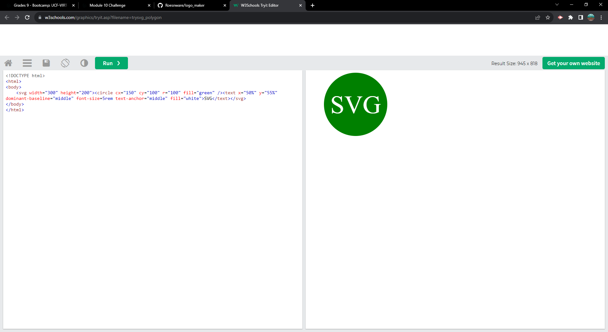

# logo maker
## Description
    
    I want to create a program that takes input from a developer and creates an svg logo using that data in cmd line for quick logos.
    This program allows users the ability to make a logo from commmand line without having to make the logo themselves or hire a designer.
    I learned OOP, jest, aswell as how to work with node.js.

## Table of Contents

- [Usage](#usage)
- [Installation](#installation)
- [Test](#test)
- [Demo](#demo)
- [Test](#test)
- [Report](#report)
- [Questions](#questions)
- [License](#license)
- [Contributing](#contributing)

## Usage
    
    Users can use this app by installing the required packages such as inquirer and fs, and then run the index file using node. Make sure to have jest for test cases aswell.

## Installation
    
    npm i, node index.js

## Demo 

## Test

## Report

    To report issues please refer to my contact section.

## Questions

    Contact me for any additional questions: Github- Roesnware Email- bubwub04@gmail.com
    
## License

    
## Contributing
    
    To make contributions please reach out to me on Github or by Email.
